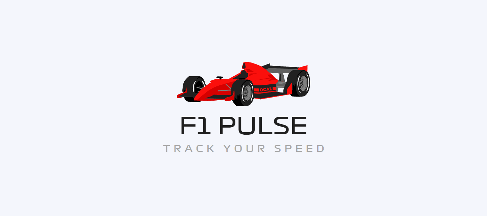

  <h1> F1 Pulse </h1>

  

   
  This application was created to make it simple for users to access seasonal statistics. Its user-friendly design makes it very simple to use.

## Features
- The application is quite clear and user-friendly.
- Users can view the season's race schedule, fixtures and champions of past seasons.
- Users can click the notification button from the calendar section. With this button, you can receive a race notification before the race.

<!-- ## ScreenShots

  
  
  

 -->

## Technologies

  
  

